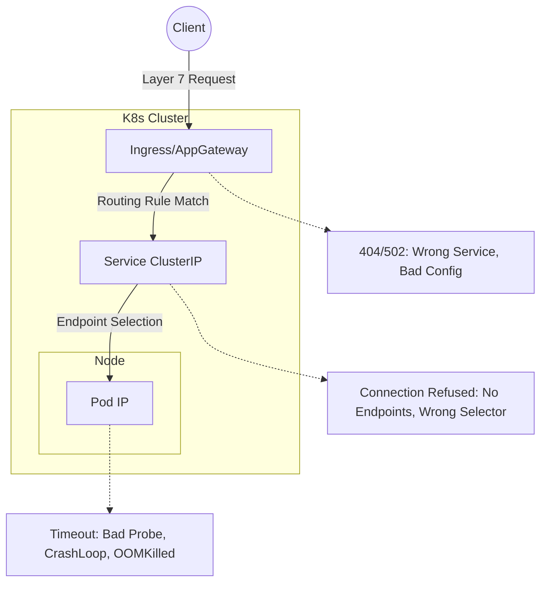

# Live Kubernetes Debugging Workflow

> **Active debugging:** use [DEBUG-RUNBOOK.md](../DEBUG-RUNBOOK.md) at the repo root — symptom-based ToC, copy-paste fix commands, one file.
>
> **This file** covers the investigation workflow: how to think through a failure, what to avoid, and how to verify fixes.

Use this guide as your operational path. Use [ENGINEERING-DEPTH.md](./ENGINEERING-DEPTH.md) for deeper theory and architecture questions.

## Visualizing the Broken Path

Kubernetes debugging is highly visual. Before you run commands, picture the path of a request to understand where the "chain" is breaking:



## Goal

Demonstrate that you can:
- Triage quickly without guessing.
- Narrow the blast radius before changing anything.
- Explain your reasoning while you inspect the cluster.
- Make the smallest safe fix.
- Verify that the application is actually healthy after the change.

## How To Use This Repo

Use the repo in this order:

1. Read this guide once and practice the command flow on a local cluster.
2. Use [playbooks/common-issues.md](../playbooks/common-issues.md) as a symptom-to-cause reference.
3. Use [docs/engineers/pod-startup-issues.md](./engineers/pod-startup-issues.md) and [docs/engineers/debugging-techniques.md](./engineers/debugging-techniques.md) when the issue is in pod startup, probes, config, or runtime behaviour.
4. Use scripts in `scripts/diagnostics/` as command inspiration — not as your first move on a live cluster.

## Safe Debugging Workflow

### 1. Establish Scope

Start with read-only commands and narrate what you are checking:

```bash
kubectl config current-context
kubectl get ns
kubectl get pods -A
kubectl get events -A --sort-by=.metadata.creationTimestamp | tail -50
```

What you are looking for:
- One namespace with obvious failures.
- One workload with repeated restarts, failed scheduling, failed image pulls, or readiness problems.
- Warning events that already point to the root cause.

### 2. Identify The Broken Path

Once you find the suspect namespace or workload:

```bash
kubectl get deploy,rs,po,svc,ing -n <namespace>
kubectl describe deployment <deployment> -n <namespace>
kubectl describe pod <pod> -n <namespace>
kubectl logs <pod> -n <namespace> --previous
kubectl get endpoints <service> -n <namespace>
```

Keep the investigation ordered:
- Deployment and ReplicaSet tell you the intended state.
- Pod status and events tell you what is blocking reality.
- Logs tell you whether the container starts and fails, or never starts at all.
- Service endpoints tell you whether traffic can reach any healthy pod.

### 3. Classify The Failure

#### `Pending`

```bash
kubectl describe pod <pod> -n <namespace>
kubectl get nodes
kubectl describe node <node>
kubectl get pvc -n <namespace>
```

Common causes:
- Unschedulable because of CPU or memory requests.
- Taints without tolerations.
- Node selectors or affinity rules that match no node.
- Unbound PVCs.

#### `CrashLoopBackOff` or `Error`

```bash
kubectl logs <pod> -n <namespace> --previous
kubectl describe pod <pod> -n <namespace>
kubectl get pod <pod> -n <namespace> -o yaml
```

Common causes:
- Bad command or entrypoint.
- Missing environment variable, Secret, or ConfigMap key.
- Probe failure causing restarts.
- Port mismatch between the app and the manifest.
- Resource limits too low.

#### `ImagePullBackOff` or `ErrImagePull`

```bash
kubectl describe pod <pod> -n <namespace>
```

Common causes:
- Wrong image tag.
- Missing image pull secret.
- Registry auth issue.
- Private registry network access issue.

#### Pod Is Running But App Still Fails

```bash
kubectl get pod <pod> -n <namespace> -o wide
kubectl get svc -n <namespace>
kubectl get endpoints -n <namespace>
kubectl describe svc <service> -n <namespace>
kubectl get ingress -n <namespace>
kubectl get networkpolicy -A
```

Common causes:

- Readiness probe failing — pod never enters service endpoints.
- Service selector does not match pod labels.
- Wrong target port or container port.
- Ingress points to the wrong service or port.
- NetworkPolicy blocks traffic.

#### DNS Or Service Discovery Issue

```bash
kubectl get pods -n kube-system
kubectl get svc -A
kubectl get endpoints -A
kubectl logs -n kube-system -l k8s-app=kube-dns --tail=50
```

Use `kubectl exec` or `kubectl debug` only after narrowing the issue, and only when you can explain why interactive shell access is necessary:

```bash
kubectl exec -it <pod> -n <namespace> -- sh
kubectl debug -it <pod> -n <namespace> --target=<container> --image=busybox -- sh
```

## High-Value Fix Areas

The most common root causes in a live broken cluster:
- Wrong image tag or image name.
- Wrong port in `containerPort`, `targetPort`, probe, or Ingress backend.
- Missing or malformed environment variable.
- Secret or ConfigMap key mismatch.
- Readiness or liveness probe path mismatch.
- Resource requests too high for the cluster, or limits too low for the app.
- Service selector mismatch.
- PVC not bound or wrong storage class.

## Safe Change Strategy

Before patching anything:
- State the current symptom.
- State the single root cause you believe is most likely.
- State the exact change you are about to make.

Then make the smallest change possible:

```bash
kubectl edit deployment <deployment> -n <namespace>
kubectl patch deployment <deployment> -n <namespace> ...
kubectl set image deployment/<deployment> <container>=<image> -n <namespace>
```

Avoid broad or destructive actions until you are certain of the root cause.

## Verification Checklist

After the fix:

```bash
kubectl rollout status deployment/<deployment> -n <namespace>
kubectl get pods -n <namespace>
kubectl describe pod <new-pod> -n <namespace>
kubectl get endpoints <service> -n <namespace>
kubectl logs <new-pod> -n <namespace> --tail=50
```

Confirm all of these:
- New pod is scheduled and stays up.
- Readiness becomes true.
- Service endpoints are populated.
- The user-facing symptom is gone.

## What To Avoid On A Live Cluster

- Do not start with mutation scripts from `scripts/fixes/`.
- Do not create test resources unless you can explain why they are necessary.
- Do not assume it is a cloud-provider problem unless the evidence points there.
- Do not restart before understanding why it failed.
- Do not rely on optional tooling not available in the environment.

## Key References

- [DEBUG-RUNBOOK.md](../DEBUG-RUNBOOK.md) — active debugging reference
- [playbooks/common-issues.md](../playbooks/common-issues.md)
- [docs/engineers/pod-startup-issues.md](./engineers/pod-startup-issues.md)
- [docs/engineers/debugging-techniques.md](./engineers/debugging-techniques.md)
- [docs/emergency-response.md](./emergency-response.md)

## Practice Scenarios

Use the [practice/](../practice/) folder to build a repeatable investigation loop on a local cluster. Deliberately break:
- Image tag
- Probe path
- Service selector
- Target port
- ConfigMap key
- Resource requests

The goal is muscle memory for the investigation loop, not memorising commands.
