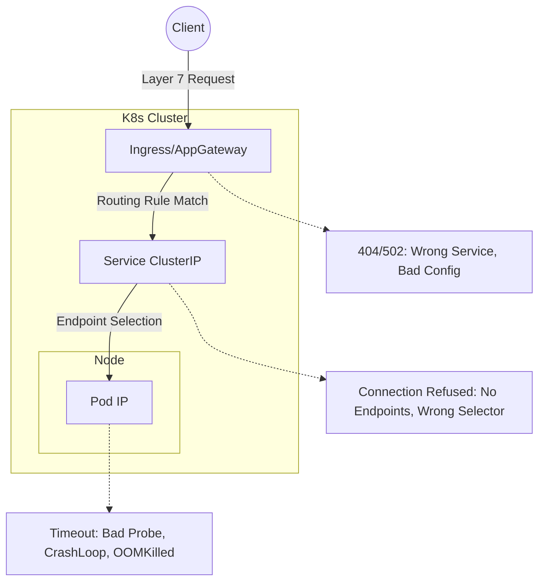

# Live Kubernetes Debugging Workflow

> **Active debugging:** use [DEBUG-RUNBOOK.md](../DEBUG-RUNBOOK.md) at the repo root — symptom-based ToC, copy-paste fix commands, one file.
>
> **This file** covers the investigation workflow: how to think through a failure, what to avoid, and how to verify fixes.
>
> **If Docker Desktop or Minikube is broken first:** use [LOCAL-CLUSTER-DEBUGGING.md](./LOCAL-CLUSTER-DEBUGGING.md).

Use this guide as your operational path. Use [ENGINEERING-DEPTH.md](./ENGINEERING-DEPTH.md) for deeper theory and architecture questions.

## Visualizing the Broken Path

Kubernetes debugging is highly visual. Before you run commands, picture the path of a request to understand where the "chain" is breaking:



## Goal

Demonstrate that you can:
- Triage quickly without guessing.
- Narrow the blast radius before changing anything.
- Explain your reasoning while you inspect the cluster.
- Make the smallest safe fix.
- Verify that the application is actually healthy after the change.

## How To Use This Repo

Use the repo in this order:

1. Read this guide once and practice the command flow on a local cluster.
2. Use [playbooks/common-issues.md](../playbooks/common-issues.md) as a symptom-to-cause reference.
3. Use [docs/engineers/pod-startup-issues.md](./engineers/pod-startup-issues.md) and [docs/engineers/debugging-techniques.md](./engineers/debugging-techniques.md) when the issue is in pod startup, probes, config, or runtime behaviour.
4. If the local lab platform is unhealthy, switch to [LOCAL-CLUSTER-DEBUGGING.md](./LOCAL-CLUSTER-DEBUGGING.md).
5. Use scripts in `scripts/diagnostics/` as command inspiration — not as your first move on a live cluster.

## Safe Debugging Workflow

### 1. Establish Scope

Start with read-only commands and narrate what you are checking:

```bash
kubectl config current-context
kubectl get ns
kubectl get pods -A
kubectl get events -A --sort-by=.metadata.creationTimestamp | tail -50
```

What you are looking for:
- One namespace with obvious failures.
- One workload with repeated restarts, failed scheduling, failed image pulls, or readiness problems.
- Warning events that already point to the root cause.

### 2. Identify The Broken Path

Once you find the suspect namespace or workload:

```bash
kubectl get deploy,rs,po,svc,ing -n <namespace>
kubectl describe deployment <deployment> -n <namespace>
kubectl describe pod <pod> -n <namespace>
kubectl logs <pod> -n <namespace> --previous
kubectl get endpoints <service> -n <namespace>
```

Keep the investigation ordered:
- Deployment and ReplicaSet tell you the intended state.
- Pod status and events tell you what is blocking reality.
- Logs tell you whether the container starts and fails, or never starts at all.
- Service endpoints tell you whether traffic can reach any healthy pod.

### 3. Classify The Failure

#### `Pending`

```bash
kubectl describe pod <pod> -n <namespace>
kubectl get nodes
kubectl describe node <node>
kubectl get pvc -n <namespace>
```

Candidate causes and evidence-backed fixes:
- **Unschedulable (CPU/Memory):** The cluster is full.
  - *Fix after evidence:* scale non-critical workloads only with approval, lower excessive requests in the source manifest, or add capacity.
- **Taints without tolerations:** Node doesn't allow the pod.
  - *Fix:* `kubectl patch deployment <name> -n <ns> --type='json' -p='[{"op": "add", "path": "/spec/template/spec/tolerations", "value": [{"key": "key", "operator": "Exists"}]}]'`
- **Node selectors match no node:**
  - *Fix:* `kubectl patch deployment <name> -n <ns> --type='json' -p='[{"op": "remove", "path": "/spec/template/spec/nodeSelector"}]'`
- **Unbound PVCs:**
  - *Fix after evidence:* verify StorageClass and provisioner first. Do not delete a production PVC unless the data owner confirms it is disposable.

#### `CrashLoopBackOff` or `Error`

```bash
kubectl logs <pod> -n <namespace> --previous
kubectl describe pod <pod> -n <namespace>
kubectl get pod <pod> -n <namespace> -o yaml
```

Candidate causes and evidence-backed fixes:
- **Bad command or entrypoint:**
  - *Fix:* `kubectl patch deployment <name> -n <ns> --type='json' -p='[{"op": "replace", "path": "/spec/template/spec/containers/0/command", "value": ["new-command"]}]'`
- **Missing environment variable, Secret, or ConfigMap key:**
  - *Fix:* `kubectl set env deployment/<name> KEY=VALUE -n <ns>`
- **Probe failure causing restarts:**
  - *Fix:* `kubectl patch deployment <name> -n <ns> --type='json' -p='[{"op": "replace", "path": "/spec/template/spec/containers/0/livenessProbe/initialDelaySeconds", "value": 30}]'`
- **Port mismatch between the app and the manifest:**
  - *Fix:* `kubectl patch deployment <name> -n <ns> --type='json' -p='[{"op": "replace", "path": "/spec/template/spec/containers/0/ports/0/containerPort", "value": 8080}]'`
- **Resource limits too low (OOMKilled):**
  - *Fix:* `kubectl set resources deployment <name> -c <container> --limits=memory=512Mi`

#### `ImagePullBackOff` or `ErrImagePull`

```bash
kubectl describe pod <pod> -n <namespace>
```

Candidate causes and evidence-backed fixes:
- **Wrong image tag:**
  - *Fix:* `kubectl set image deployment/<name> <container>=<image>:<correct-tag> -n <ns>`
- **Missing image pull secret:**
  - *Fix:* `kubectl patch deployment <name> -n <ns> --type='json' -p='[{"op": "add", "path": "/spec/template/spec/imagePullSecrets", "value": [{"name": "my-secret"}]}]'`
- **Registry auth issue / Private registry network access issue:**
  - *Fix:* Check pod events for network timeouts vs auth failures. Update `imagePullSecrets` or fix node routing.

#### Pod Is Running But App Still Fails

```bash
kubectl get pod <pod> -n <namespace> -o wide
kubectl get svc -n <namespace>
kubectl get endpoints -n <namespace>
kubectl describe svc <service> -n <namespace>
kubectl get ingress -n <namespace>
kubectl get networkpolicy -A
```

Candidate causes and evidence-backed fixes:
- **Readiness probe failing (pod never enters service endpoints):**
  - *Fix:* `kubectl patch deployment <name> -n <ns> --type='json' -p='[{"op": "replace", "path": "/spec/template/spec/containers/0/readinessProbe/httpGet/path", "value": "/healthz"}]'`
- **Service selector does not match pod labels:**
  - *Fix:* `kubectl patch svc <name> -n <ns> --type='json' -p='[{"op": "replace", "path": "/spec/selector/app", "value": "correct-label"}]'`
- **Wrong target port or container port:**
  - *Fix:* `kubectl patch svc <name> -n <ns> --type='json' -p='[{"op": "replace", "path": "/spec/ports/0/targetPort", "value": 8080}]'`
- **Ingress points to the wrong service or port:**
  - *Fix:* `kubectl edit ingress <name> -n <ns>` to correct the backend service mapping.
- **NetworkPolicy blocks traffic:**
  - *Fix:* Apply or update NetworkPolicy to allow ingress from the correct namespace/pod labels.

#### DNS Or Service Discovery Issue

```bash
kubectl get pods -n kube-system
kubectl get svc -A
kubectl get endpoints -A
kubectl logs -n kube-system -l k8s-app=kube-dns --tail=50
```

Candidate causes and evidence-backed fixes:
- **CoreDNS pods are crashing/failing:**
  - *Fix:* `kubectl delete pod -n kube-system -l k8s-app=kube-dns` to force a restart.
- **Node networking issues preventing DNS queries:**
  - *Fix:* Check CNI logs (e.g. `kubectl logs -n kube-system -l k8s-app=calico-node`).

Use `kubectl exec` or `kubectl debug` only after narrowing the issue, and only when you can explain why interactive shell access is necessary:

```bash
kubectl exec -it <pod> -n <namespace> -- sh
kubectl debug -it <pod> -n <namespace> --target=<container> --image=busybox -- sh
```

## Advanced Debugging Tools & Techniques

When standard commands aren't enough, escalate to these advanced tools:

- **Ephemeral Containers:** Attach a debugging container to a running pod that has crashed or lacks a shell (e.g., distroless images).
  - `kubectl debug -it <pod> -n <namespace> --image=busybox --target=<container>`
- **Node-Level Debugging:** Get a privileged shell on the underlying host to check kubelet logs or system pressure.
  - `kubectl debug node/<node-name> -it --image=ubuntu`
  - Inside the node: `chroot /host`, `journalctl -u kubelet`, `df -h`
- **Network Packet Sniffing:** Capture TCP traffic for deep protocol analysis.
  - Use `ksniff` (a kubectl plugin) or run `tcpdump` within a debug container to diagnose connection resets or dropped packets.

## Complex Production Scenarios

Candidate causes and evidence-backed fixes for deeper infrastructure issues:

- **The "DNS Cascade":** A single failing service with aggressive retry logic overwhelms CoreDNS, leading to a cluster-wide DNS resolution outage.
  - *Fix:* Scale CoreDNS, implement `NodeLocal DNSCache`, and fix the offending app's retry/backoff logic.
- **MTU Mismatches & CNI Failures:** Large packets drop between nodes, causing intermittent TCP timeouts (common in on-prem, custom VNets, or nested overlays).
  - *Fix:* Check CNI MTU configuration versus the underlying node interface MTU. Use `ping -s <size> -M do <node-ip>` to test path MTU.
- **SNAT Port Exhaustion:** Outbound connection failures occur when pods exhaust source NAT ports due to too many rapid external API calls.
  - *Fix:* Implement connection pooling in the app, or scale out the NAT Gateway / Load Balancer outbound IPs.
- **Requests vs. Limits (Throttling vs. OOM):** CPU limit breaches cause silent throttling (latency), whereas Memory limit breaches cause immediate crashes (`OOMKilled` / Exit Code 137).
  - *Fix:* Check `container_cpu_cfs_throttled_seconds_total` in Prometheus. Increase limits or remove CPU limits entirely for latency-sensitive workloads.
- **NodeNotReady (PLEG Issues):** Nodes get stuck in `NotReady` because the Pod Lifecycle Event Generator (PLEG) is unhealthy, often due to a hung container runtime or heavy disk I/O.
  - *Fix:* Check `journalctl -u kubelet` for PLEG timeout errors. Restart the container runtime (e.g., `systemctl restart containerd`) or drain and reboot the node.

### Cloud-Specific Failures (AKS)
- **Outbound Connectivity Blocking:** `OutboundConnFailVMExtensionError` during provisioning or scaling, caused by a firewall or NSG blocking traffic to required Microsoft Container Registry (MCR) endpoints.
  - *Fix:* Whitelist cluster CIDR or required FQDNs on the outbound firewall.
- **Expired Service Principals:** Cluster cannot perform operations, scale, or pull images from Azure Container Registry (ACR), often presenting as `AADSTS7000222`.
  - *Fix:* Update SP credentials or migrate the cluster to Managed Identities.
- **Diagnostic Tooling:** Use **AKS Periscope** and **Inspector Gadget** to collect node logs and trace low-level Linux TCP events dynamically.

## High-Value Fix Areas

The most common root causes in a live broken cluster:
- Wrong image tag or image name.
- Wrong port in `containerPort`, `targetPort`, probe, or Ingress backend.
- Missing or malformed environment variable.
- Secret or ConfigMap key mismatch.
- Readiness or liveness probe path mismatch.
- Resource requests too high for the cluster, or limits too low for the app.
- Service selector mismatch.
- PVC not bound or wrong storage class.

## Safe Change Strategy

Before patching anything:
- State the current symptom.
- State the single root cause you believe is most likely.
- State the exact change you are about to make.

Then make the smallest change possible:

```bash
kubectl edit deployment <deployment> -n <namespace>
kubectl patch deployment <deployment> -n <namespace> ...
kubectl set image deployment/<deployment> <container>=<image> -n <namespace>
```

Avoid broad or destructive actions until you are certain of the root cause.

## Verification Checklist

After the fix:

```bash
kubectl rollout status deployment/<deployment> -n <namespace>
kubectl get pods -n <namespace>
kubectl describe pod <new-pod> -n <namespace>
kubectl get endpoints <service> -n <namespace>
kubectl logs <new-pod> -n <namespace> --tail=50
```

Confirm all of these:
- New pod is scheduled and stays up.
- Readiness becomes true.
- Service endpoints are populated.
- The user-facing symptom is gone.

## What To Avoid On A Live Cluster

- Do not start with mutation scripts from `scripts/fixes/`.
- Do not create test resources unless you can explain why they are necessary.
- Do not assume it is a cloud-provider problem unless the evidence points there.
- Do not restart before understanding why it failed.
- Do not rely on optional tooling not available in the environment.

## Key References

- [DEBUG-RUNBOOK.md](../DEBUG-RUNBOOK.md) — active debugging reference
- [playbooks/common-issues.md](../playbooks/common-issues.md)
- [docs/engineers/pod-startup-issues.md](./engineers/pod-startup-issues.md)
- [docs/engineers/debugging-techniques.md](./engineers/debugging-techniques.md)
- [docs/emergency-response.md](./emergency-response.md)

## Practice Scenarios

Use the [practice/](../practice/) folder to build a repeatable investigation loop on a local cluster. Deliberately break:
- Image tag
- Probe path
- Service selector
- Target port
- ConfigMap key
- Resource requests

The goal is muscle memory for the investigation loop, not memorising commands.
